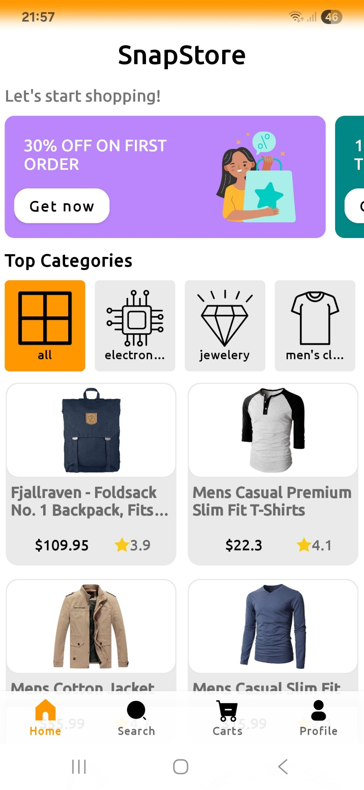
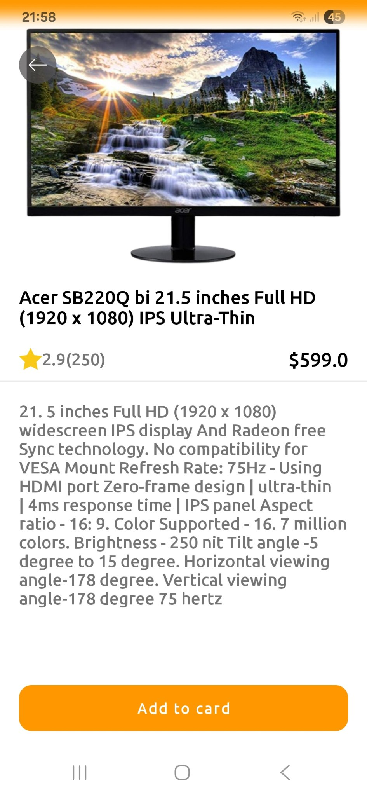
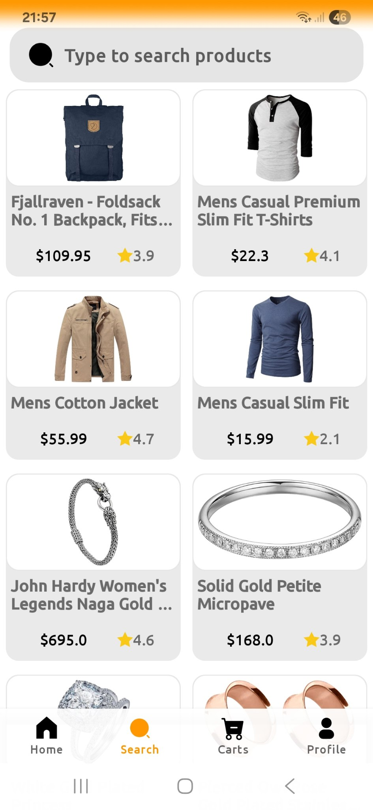
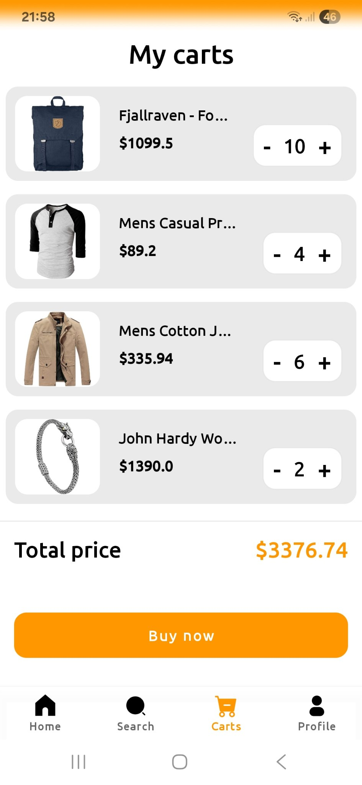

# About 💡
A prototype of shopping app with a modern, user-friendly design and fake API integration for product browsing and cart management.
### Used Technologies 📀
Kotlin, Clean Architecture, MVVM, RxJava, Retrofit, Dagger2 

### Screenshots

  
  
  
  
  

## Download SnapStore APK file

[👉 Download APK](apk/SnapStore.apk?raw=true)

